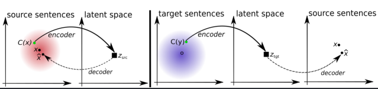
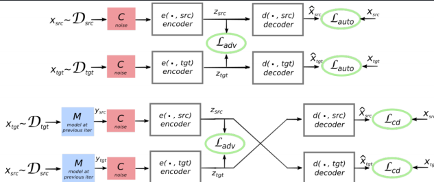
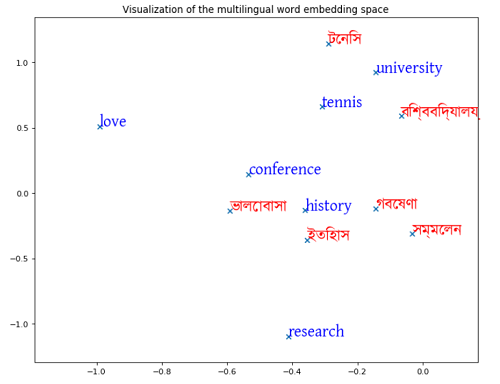
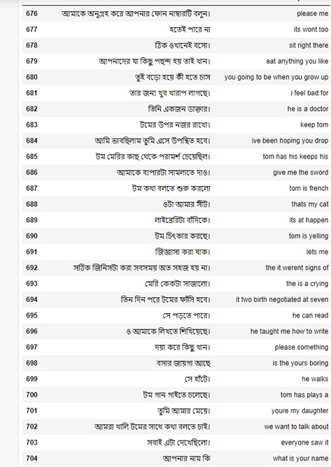

# Unsupervised Neural Machine Translation (Bangla To English & English to Bangla)

Neural machine translation (NMT) has recently become the dominant paradigm to machine translation (Bahdanau et al., 2014; Sutskever et al., 2014). As opposed to the traditional statistical machine translation (SMT), NMT systems are trained end-to-end, take advantage of continuous representations that greatly alleviate the sparsity problem, and make use of much larger contexts, thus mitigating the locality problem. The essential advantage of NMT is that it gives a solitary system that can be prepared to unravel the source and target text.One of the most well recognized NMT library is Multilingual Unsupervised and Supervised Embeddings. 

* state-of-the-art multilingual word embeddings ([fastText](https://github.com/facebookresearch/fastText/tree/main/alignment) embeddings aligned in a common space)
* large-scale high-quality bilingual dictionaries for training and evaluation
* Multilingual Unsupervised and Supervised Embeddings([MUSE](https://github.com/facebookresearch/MUSE)).

This approach includes both *supervised* method that uses a bilingual dictionary or identical character strings, and also *unsupervised* method that does not use any parallel data (see [Word Translation without Parallel Data](https://arxiv.org/pdf/1710.04087.pdf) for more details).

## Dependencies
* Python >=3.5.0
* [NumPy](http://www.numpy.org/)
* Jupyter-Notebook
* gensim
* tqdm
* [SciPy](https://www.scipy.org/)
* [PyTorch](http://pytorch.org/)
* [Faiss](https://github.com/facebookresearch/faiss) (recommended) for fast nearest neighbor search (CPU or GPU).
* [MUSE](https://github.com/facebookresearch/MUSE)

## Datasets
SUPara0.8M: A Balanced English-Bangla Parallel Corpus [SUPARA-BENCHMARK](https://ieee-dataport.org/open-access/supara-benchmark-benchmark-dataset-english-bangla-machine-translation)

To download monolingual and cross-lingual word embeddings evaluation datasets:
* [bilingual dictionaries](https://github.com/facebookresearch/MUSE#ground-truth-bilingual-dictionaries)
* 28 monolingual word similarity tasks for 6 languages, and the English word analogy task
* Cross-lingual word similarity tasks from [SemEval2017](http://alt.qcri.org/semeval2017/task2/)
* Sentence translation retrieval with [Europarl](http://www.statmt.org/europarl/) corpora

You can simply run:

```bash
cd data/
wget https://dl.fbaipublicfiles.com/arrival/vectors.tar.gz
wget https://dl.fbaipublicfiles.com/arrival/wordsim.tar.gz
wget https://dl.fbaipublicfiles.com/arrival/dictionaries.tar.gz
```

Alternatively, you can also download the data with:

```bash
cd data/
./get_evaluation.sh
```

*Note: Requires bash 4. The download of Europarl is disabled by default (slow), you can enable it [here](https://github.com/facebookresearch/MUSE/blob/master/data/get_evaluation.sh#L99-L100).*

## Methodology 

The key idea is to create a common latent space between the two languages (or domains),in our case English and Bangla, and learn to translate by reconstructing in both domains

Principles:

* The model has to be able to reconstruct a sentence in a given language from a noisy version of it, as in standard denoising auto-encoders
* The model also learns to reconstruct any source sentence given a noisy translation of the same sentence in the target domain,and vice versa.



Unsupervised Encoding-Decoding

An encoder and a decoder, respectively responsible for encoding source and target sentences to a latent space, and to decode from that latent space to the source or the target domain.A single encoder and a single decoder for used in both the domains. The only difference when applying these modules to different languages is the choice of lookup tables.



Our Performed steps: 

* Encode-Decode using generic data which was parallelized (Provided by MUSE)  
* Performed Seq-to-Seq Enc-Dec-LSTM training with that Parallel Dataset. The results were noteworthy with the provided dataset but requires more testing with other datasets.
* Then changed to FastText Alligned Vector and generated the Word Embedding From Vector using MUSE

### Monolingual word embeddings
For pre-trained monolingual word embeddings, we highly recommend [fastText Wikipedia embeddings](https://fasttext.cc/docs/en/pretrained-vectors.html), or using [fastText](https://github.com/facebookresearch/fastText) to train your own word embeddings from your corpus.

You can download the English (en) embeddings this way:
```bash
# English fastText Wikipedia embeddings
curl -Lo data/wiki.en.vec https://dl.fbaipublicfiles.com/fasttext/vectors-wiki/wiki.en.vec
```

You can download the Bangla (bn) embeddings this way:
```bash
# Bangla fastText Wikipedia embeddings
curl -Lo data/wiki.bn.vec https://dl.fbaipublicfiles.com/fasttext/vectors-wiki/wiki.bn.vec
```

### Align monolingual word embeddings
(https://en.wikipedia.org/wiki/Orthogonal_Procrustes_problem) alignment.
* **Unsupervised**: without any parallel data or anchor point, learn a mapping from the source to the target space using adversarial training and (iterative) Procrustes refinement.

#### The unsupervised way: adversarial training and refinement (CPU|GPU)
To learn a mapping using adversarial training and iterative Procrustes refinement, run:

```bash
python3 unsupervised.py --src_lang en --tgt_lang es --src_emb data/wiki.en.vec --tgt_emb data/wiki.es.vec --n_refinement 5
```

By default, the validation metric is the mean cosine of word pairs from a synthetic dictionary built with CSLS (Cross-domain similarity local scaling). For some language pairs (e.g. En-Bn),
we recommend to center the embeddings using `--normalize_embeddings center`.

#### Evaluate monolingual or cross-lingual embeddings (CPU|GPU)

We also include a simple script to evaluate the quality of monolingual or cross-lingual word embeddings on several tasks:

**Monolingual**
```bash
python3 evaluate.py --src_lang en --src_emb data/wiki.en.vec --max_vocab 200000
```

**Cross-lingual**
```bash
python3 evaluate.py --src_lang en --tgt_lang bn --src_emb data/wiki.en-bn.en.vec --tgt_emb data/wiki.en-es.bn.vec --max_vocab 200000
```
## Word embedding format
By default, the aligned embeddings are exported to a text format at the end of experiments: `--export txt`. Exporting embeddings to a text file can take a while if you have a lot of embeddings. For a very fast export, you can set `--export pth` to export the embeddings in a PyTorch binary file, or simply disable the export (`--export ""`).

When loading embeddings, the model can load:
* PyTorch binary files previously generated by MUSE (.pth files)
* fastText binary files previously generated by fastText (.bin files)
* text files (text file with one word embedding per line)

The two first options are very fast and can load 1 million embeddings in a few seconds, while loading text files can take a while.

## Download
We provide multilingual embeddings and ground-truth bilingual dictionaries. These embeddings are fastText embeddings that have been aligned in a common space.

##### Multilingual word Embeddings
We release fastText Wikipedia **supervised** word embeddings for **30** languages, aligned in a **single vector space**.

Bengali: [full](https://dl.fbaipublicfiles.com/arrival/dictionaries/bn-en.txt) [train](https://dl.fbaipublicfiles.com/arrival/dictionaries/bn-en.0-5000.txt) [test](https://dl.fbaipublicfiles.com/arrival/dictionaries/bn-en.5000-6500.txt) 

##### 1. Download the Vectors from these Fast Text vectors.
* i.  Bangla [vectors-bn.txt](https://dl.fbaipublicfiles.com/fasttext/vectors-crawl/cc.bn.300.vec.gz) 
* ii. English [vectors-en.txt](https://dl.fbaipublicfiles.com/fasttext/vectors-crawl/cc.en.300.vec.gz) 

##### 2. Then place these vectors in ./data/vec/vectors-{bn.en}.txt location. 
* Download src.pickle from this [link](https://drive.google.com/file/d/19bGSyykc5oYeUwy7BJS6PFm0BSbnRrUa/view) and place in the root directory. 
* Download tgt.pickle from this [link](https://drive.google.com/file/d/1GuFLa9lAvzXxfpWkGspmxefQ_m544H5S/view) and place in the root directory. 
* Download all.pickle from this [link](https://drive.google.com/file/d/1SVsgUKXeGf3gbZmhqFwM3_mLgH5MB0ec/view) and place in the root directory. 

### Visualization of the multilingual word embedding space

**Nearest Neighbors(NN)**

Precision Obtained at

k = 1: 32.333333 <br />
k = 5: 52.666667 <br />
k = 10: 60.266667 <br />

**K nearest neighbors(KNN)** for **Cross-domain similarity local scaling (CSLS)**  

Precision Obtained at 

k = 1: 35.933333 <br />
k = 5: 56.200000 <br />
k = 10: 63.200000 <br />



## Results Outputs
#### Eng-to Bangla 
<!-- To Resize need to use http link
 
-->

<!--
[Text Preprocessing](./docs/text_preprocessing.jpg)
-->
```bash

Input sentence: Go.
Decoded sentence: যাও।

Input sentence: Smile.
Decoded sentence: একটু হাসুন।

Input sentence: Hit Tom.
Decoded sentence: টমকে মারুন।

Input sentence: Help me!
Decoded sentence: আমাদের সাহায্য করুন।

Input sentence: Call me.
Decoded sentence: আমাকে আগামীকাল ফোন করবেন।

```

#### Bangla-To English

```bash
Input sentence: যাও।
Decoded sentence: Go.

Input sentence: একটু হাসুন।
Decoded sentence: Smile

Input sentence: টমকে মারুন।
Decoded sentence: Hit Tom.

Input sentence: আমাদের সাহায্য করুন।
Decoded sentence: Help me!

Input sentence: আমাকে আগামীকাল ফোন করবেন।
Decoded sentence: Call me.
```

## Testing the Model with Bilingual Translation

Download the trained_model.pt file from the following [link](https://drive.google.com/file/d/17-RFIitkcnphSQZ_CkxN_203laTO8lVH/view)
* English To Bangla Translation
* Run the following command to test and translate sample data. 

```bash
python3 translate.py -s data/eng_test.txt -sl e -t out_ben.txt
```
* Bangla To English Translation
* Run the following command to test and translate sample data. 

```bash
python3 translate.py -s data/ben_test.txt -sl b -t out_eng.txt
```

## For Training with the data and the fastText vectors run this command after placing all the vector files and data into the correct repositories.

```bash
python3 train.py -train_src_mono data/eng.txt -train_tgt_mono data/ben.txt -src_embeddings data/vec/vectors.en.txt -tgt_embeddings data/vec/vectors.bn.txt -all_vocabulary data/demo.vocab.pt -usv_embedding_training 1 -layers 3 -rnn_size 700 -src_vocab_size 40000 -tgt_vocab_size 40000 -print_every 100 -save_every 100 -usv_num_words_in_batch 250 -discriminator_hidden_size 1024 -unsupervised_epochs 10 -save_model en_ko_model_attn -sv_embedding_training 0 -reset_vocabularies 0 -src_to_tgt_dict data/en-bn.txt -tgt_to_src_dict data/bn-en.txt
```


NMT Sample Output
<!-- To Resize need to use http link
 
-->



Suprervisor
* [Dr. Nabeel Mohammed](http://ece.northsouth.edu/people/dr-nabeel-mohammed/)

###  Author Names and Contribution

* [Md Sajid Ahmed](https://sites.google.com/view/sajid-site)
* [Zahin Akram](https://www.linkedin.com/in/zahin-akram-3b9600121)
* [Arifuzzaman Arman](https://www.linkedin.com/in/arifuzzaman-a-47b34898/)
* [Md Rakib Imtiaz](https://www.linkedin.com/in/mohammad-rakib-imtiaz-277944216)

#### Contribution Per member:

* All four group members worked together to understand the paper by separating and reading the article together. All members together began the training of word embedding through MUSE. Sajid and Zahin looked at the code profoundly and worked on editing the necessary portion of what was required. Sajid later ran the model and generated the mapping that the group showed to professor Dr. Nabeel Mohammad.

* Sajid looked at the models to be used for training once the first part was over. The model's decision was decided by Zahin and Sajid together as they were primarily in charge of the assignment. We made some significant adjustments. Sajid ran the model and fixed the issues with his PC. He also had provided the dataset for training. Sajid oversaw the training progress on his PC. 

## Notes:

* A lot of issues were the specifications of available systems. The embeddings for the English vocabulary were extremely large and had to reduce down for training alongside Bangla words. We wrote some code for a specific amount of vocabulary. However, even that was not enough, Since the vocabulary was concise for Bangla. The problem was found while reading the whole file at once. It was too large for a small set of RAM to open and process it any further. We had to edit the original vocab files both for Bangla and English to address the memory error.

* We had chosen around sample 5000 words based on frequency. However, most frequent English and Bangla words aren't similar at all. So we had to relocate some words and collect the most feasible ones. Training and evaluating took a very long time to finish. The work would have been better if we had unshackled access to a robust system for an extensive period of 2 weeks for training and testing with an extensive vocabulary and bigger vector space. Then, we could

### References

- [1] Artetxe, M., Labaka, G., Agirre, E., & Cho, K. (2017). Unsupervised neural machine translation. arXiv preprint arXiv:1710.11041.
- [2] Lample, G., Conneau, A., Denoyer, L., & Ranzato, M. A. (2017). Unsupervised machine translation using monolingual corpora only. arXiv preprint arXiv:1711.00043.
- [3] Lian, X., Jain, K., Truszkowski, J., Poupart, P., & Yu, Y. (2020). Unsupervised Multilingual Alignment using Wasserstein Barycenter. arXiv preprint arXiv:2002.00743.

### For any furthur query please feel free to contact me [Md Sajid Ahmed](mailto:[sajid.ahmed1@northsouth.edu) 
